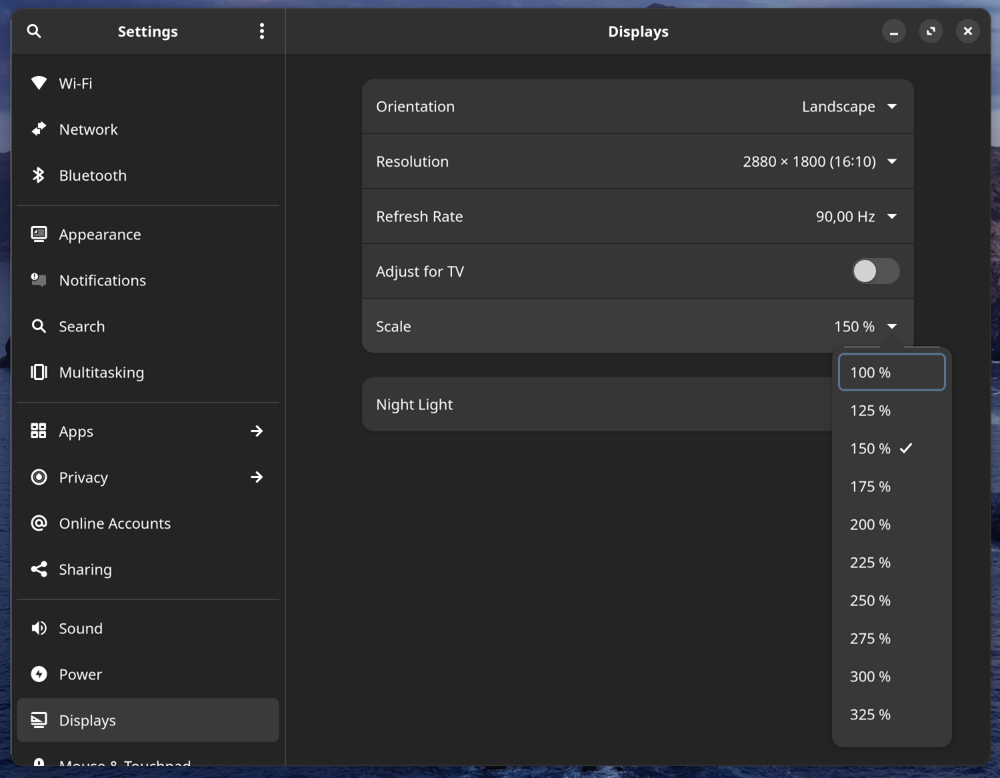

# How To Install Manjaro GNOME on Zenbook 14 UM3402YA

## Installing Manjaro

This is some fairly straight-forward, trivial setup (especially with GUI), that is described on endless platforms, and there are very decent guides,
so I'll skip this.

## Post-installation first steps...

For convenience, I recommend installing two extensions rightaway:
 - [Clipboard Indicator](https://extensions.gnome.org/extension/779/clipboard-indicator/)
   - For this to work similarly, how its counterpart behaves on Windows, you need to remap Super+V to something else in Settings/Keyboard/Keyboard Shortcuts, and then bind Super+V to Clipboard Indicator's Toggle Menu feature in its settings
 - [Dash to Dock](https://extensions.gnome.org/extension/307/dash-to-dock/)

## Enable fractional scaling

Since the notebook has a totally non standard resolution of 2880x1800, it can cause some serious headaches, if you want a non-integer scaling like 1.25 or 1.5. And since the screen has a size of 14", you'll almost always want that, otherwise it will be either too small (with 1x) or enormously big (with 2x).

The command below lets us chose fractional scaling options insde Gnome Settings.

```bash
gsettings set org.gnome.mutter experimental-features "['scale-monitor-framebuffer']"
```




Even though it works fine with most built-in apps that ship with the distro, you might experience that the picture is blurry in some applications.

Unfortunately, there's not a single way to handle such problems, but below you can find a solution to Firefox's problem.

### Enable Wayland in Firefox

```bash
mkdir -p ~/.config/environment.d/
echo "MOZ_ENABLE_WAYLAND=1" > ~/.config/environment.d/envvars.conf
```

### Enable Wayland in VSCode
```bash
# TODO
```

## Shared profile between *bash* and *zsh*

Paste this into `~/.profile`.

```bash
if [ -z "$XDG_DATA_DIRS" ]; then
    XDG_DATA_DIRS=/usr/local/share/:/usr/share/:/var/lib/snapd/desktop
else
    XDG_DATA_DIRS="$XDG_DATA_DIRS":/var/lib/snapd/desktop
fi
export XDG_DATA_DIRS
```

Then include it in **bash**:
```bash
source ~/.profile
```

And in **zsh**:
```bash
[[ -e ~/.profile ]] && emulate sh -c 'source ~/.profile'
```

## Download and install **yay** and **snap**

Yay and snap are life savers. Do install it!


Yay:

```bash
sudo pacman -S --needed git base-devel
git clone https://aur.archlinux.org/yay.git
cd yay
makepkg -si
yay -S debtap
sudo debtap -u
```

Snap:

```bash
sudo pacman -S snapd
sudo systemctl enable --now snapd.socket
sudo ln -s /var/lib/snapd/snap /snap
echo "PATH=$PATH:/snap/bin" >> ~/.profile
```

## Installing necessary development tools

This will include VSCode, gcc, g++, gdb, OpenJDK...

### Installing VSCode

Installing VSCode is best done with yay.
 
```bash
yay -S visual-studio-code-bin
```

And to make **zsh** look as cool in VSCode as it is in GNOME Terminal, change VSCode's settings like this.

```json
"editor.fontFamily": "MesloLGS NF"
```

### Installing OpenJDK

```bash
wget https://github.com/adoptium/temurin20-binaries/releases/download/jdk-20.0.2%2B9/OpenJDK20U-jdk_x64_linux_hotspot_20.0.2_9.tar.gz
tar xzf OpenJDK20U-jdk_x64_linux_hotspot_20.0.2_9.tar.gz
mkdir -p /usr/lib/jvm
sudo mkdir -p /usr/lib/jvm
sudo mv jdk-20.0.2+9/ /usr/lib/jvm/jdk-20
echo "PATH=$PATH:/usr/lib/jvm/jdk-20/bin" >> ~/.profile
```

## Getting proper sound drivers